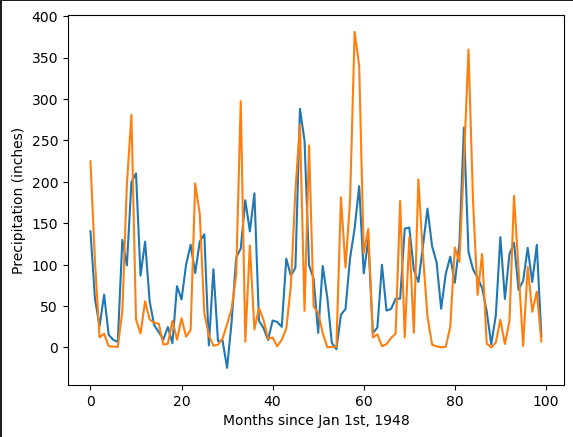
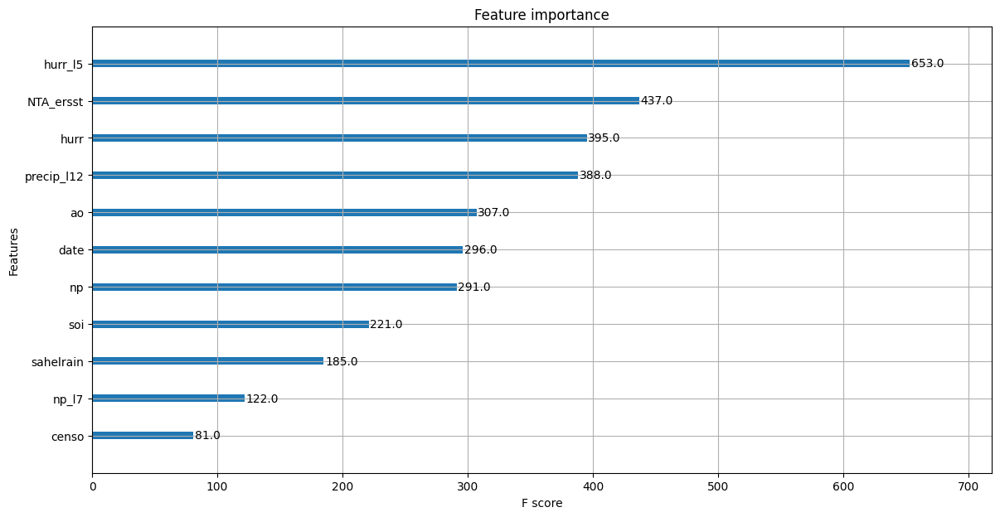
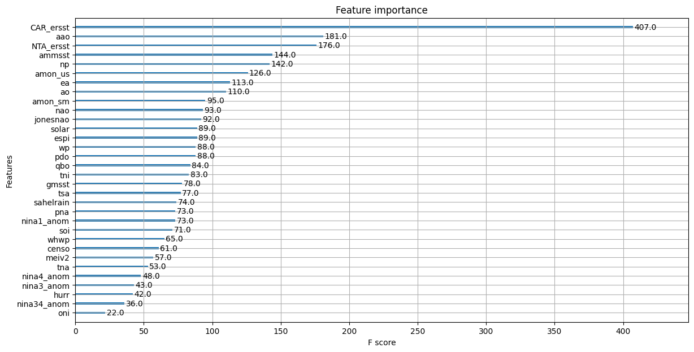

# Digital Agathon 2023: AgAID Hackathon
This project was completed during the 2023 Agathon, a 48-hour hackathon for graduate and undergraduate students with an interest in Computer Science and Agriculture

## Prompt
You will be developing and applying models to forecast cool-season (Nov-Mar) precipitation in California (in the Sacramento Basin) using existing geospatial data. The goal is to create novel approaches to enhance seasonal forecasting, which can in turn reduce risks to our water systems and help water managers efficiently manage hydrological regimes. Existing data include patterns of sea surface temperature, climate indices that represent atmospheric circulation regimes, soil moisture, and sea ice leading up to the forecast period. You will be developing models based on observations for the 1980-2022 period.
https://agaid.org/digital-agathon-2023/

## Technologies used
XGBoost, Extreme Gradient Boosting, which is a scalable distributed gradient boosted decision tree machine learning library. It provides parallel tree boosting and is the leading machine learning library for regression, classification, and ranking problems.

Azure, Microsofts public cloud platform that provided the hosting of our data and programs. It also supplemented the compute power to efficiently run our models. 

    
    
    

